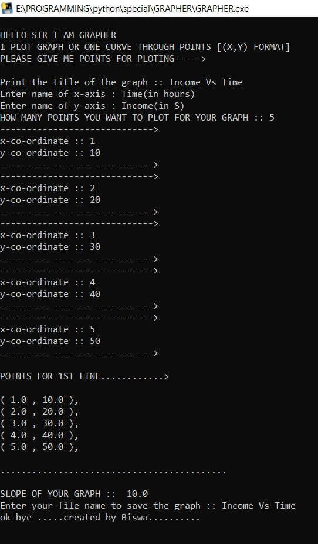
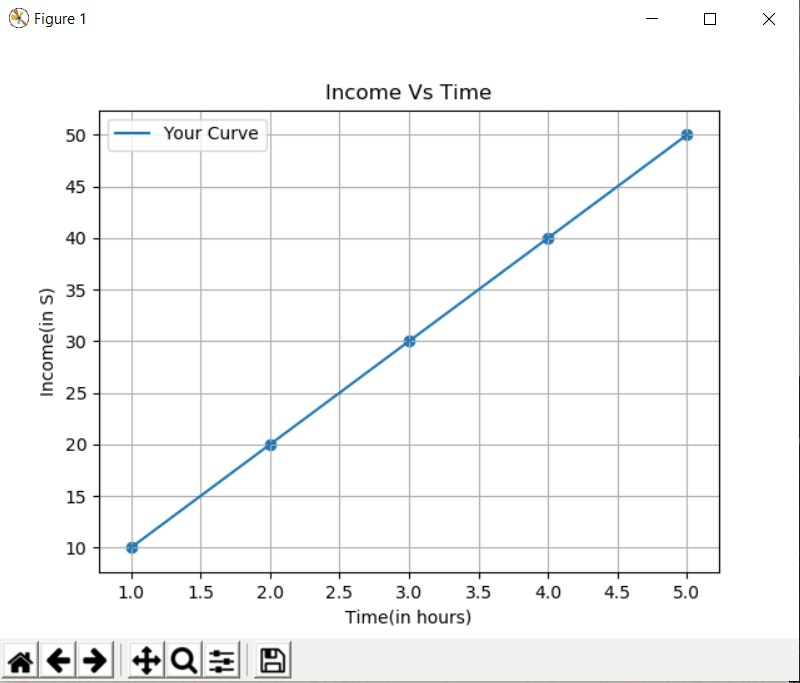

# GRAPHER :star_struck: 

[](https://shields.io/) [](https://shields.io/) [](https://shields.io/) [](https://shields.io/) [](https://shields.io/) [](https://shields.io/) [](https://shields.io/) [](https://shields.io/)
<br>

***This new GRAPHER Software using Python3 is created by Biswarup Bhattacharjee, student of BTECH, in University of Engineering and Management, Kolkata.***

**Email Id: bbiswa471@gmail.com.** 

**Contact No: 916290272740.** 

[](https://www.facebook.com/biswarup.bhattacharjee.5811) [](https://github.com/biswa2210)

## About :point_down: 

</div align="justified">

Graph plotting is a very common and impotant. I made this software Grapher for get plotted graph as result of user input co-ordinates. First of all we have to enter how many points we want to plot. Then we have to input the x and y co-ordinates accordingly. Then we can see the graph plot, slope and also a place to write the file name to save our graph. We can see the output with accurate graph plot and x and y co-ordinates' name written. 
 
</div>

## Purpose :point_down:

</div align="justified">


</div>

## Use :point_down:


## Conclusion and Future Works :point_down:

</div align="justified">


</div>

## Folder Structure :point_down:

```bash
HAND-GESTURE-RECOGNITION
      └── source code
              └── 
              
```                       
## Making :point_down:

</div align="justified">


</div>

## Screenshots :point_down: 

<div align="center">
<a href="pics/gr1.jpeg"></a> 

<a href="pics/gr2.jpeg"></a>
</div>


